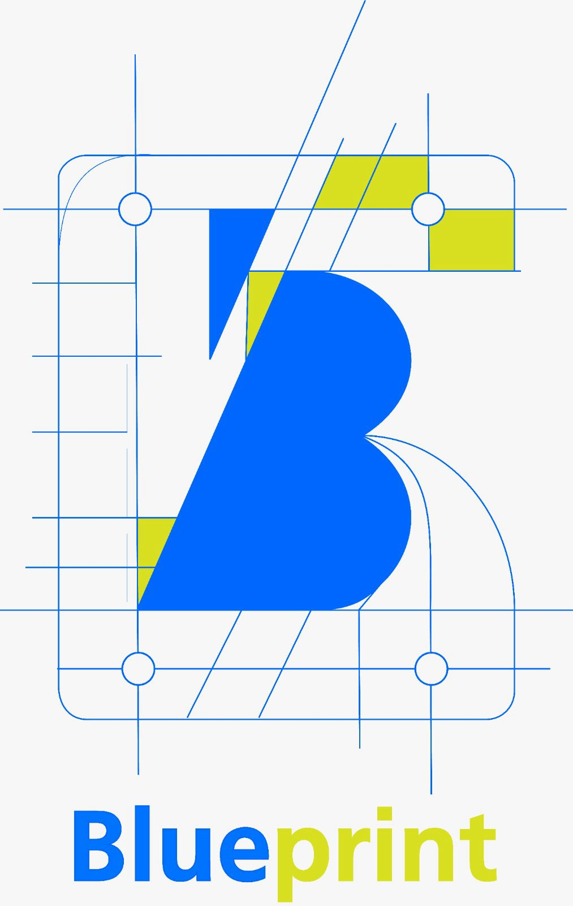

# ERUDA

### QUEM SOMOS?

**ERUDA** é uma innovation house que une indivíduos com interesse em tecnologia e inovação e que capacita jovens desenvolvedores

### COMO SURGIU

Tudo começou em uma reunião|conversa|encontro onde foi abordado o tema Inovação no primeiro trimestre de 2023. Apartir disso o tema passou a ser discutido internamente na Newnet.

No dia 26/06/2023 fechamos um contrato com a plataforma de cursos Alura para beneficiar os integrantes da Newnet com capacitação a baixo custo. Isso influenciou na intensificação das disucossões sobre capacitação profissional para o público externo.

Dia 04/08/2023 surge então o nome do primeiro protótipo Blueprint Success, que visava trazer jovens para dentro da empresa para capacitar-se profissionalmente.

Após reuniões o conceito foi repensado e um espaço de co-working e desenvolvimento de softwares além da capacitação de jovens e então um novo nome surgiu, mais agradável e elegante, ERUDA.

Dia 06/09/2023 nós fizemos uma reunião para criação da marca e a ideia de agragar a comunidade, ajudando na capacitação, surgiu, além de fortalecer a ideia de espaço de coworking e a fundação de uma empresa de desenvolvimento de softwares.

Por fim dia 04/10/2023 o conceito de Eruda ser a primeira casa de inovação de Jacobina e Região tomou forma.

 
    
    
    

As primeiras logos não possuiam identidade própria carregando as cores da Newnet, Blueprint significava exatamente o que a palavra diz, uma planta ou um projeto em azul e em conjunto com a palavra Success o significado do projeto era de construir o próprio sucesso.

#### NOSSA MISSÃO

Criar e manter uma comunidade local de desenvolvedores apaixonados, proporcionando **oportunidades** práticas e educacionais para unir pessoas com o interesse comum em tecnologia e **impulsionar a INOVAÇÃO local** 

### PIPELINE

https://www.figma.com/file/Law0AcQeYrOiwcHjl9pVVw/ERUDA-Pipeline?type=whiteboard&node-id=0%3A1&t=S9ronQHV0cQx9CCa-1

